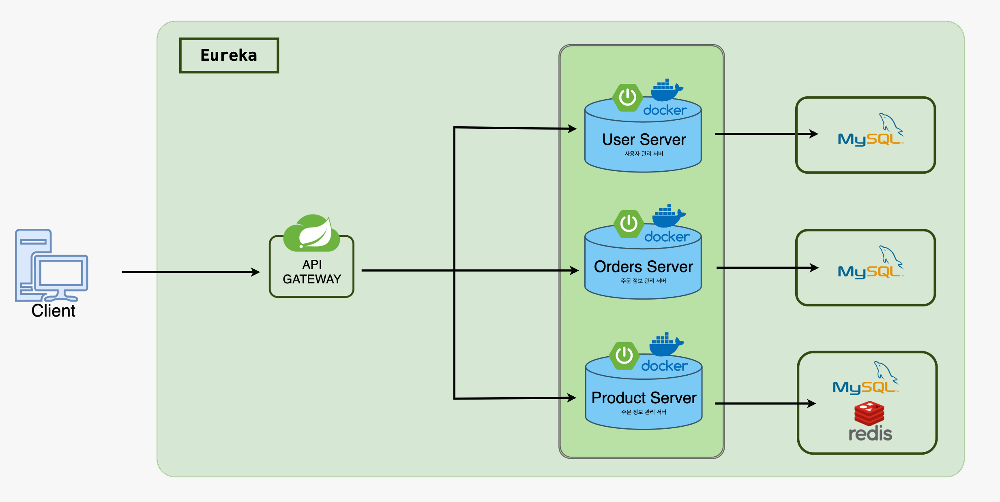

👨‍🏫 PREORDER 프로젝트 소개
---
본 프로젝트는 MSA 구조로, 독립적인 멀티모듈 구조를 통해 각 기능이 최적화되어,   유연하고 확장 가능한 서비스 운영이 가능합니다. 
 또한, 대규모 트래픽 처리와 동시성 문제 해결을 위해 분산 락을 적용하였으며,  이를 통해 시스템의 안정성과 효율성을 크게 향상시켰습니다.

💻 개발환경
---
* Version : Java 21
* Framework : SpringBoot 3.2.4
* Database : MySQL
* ORM : JPA

🛠 ERD
---

💡 기술스택
---
* 백엔드: Spring Boot를 사용하여 RESTful API를 제공하고, Spring Cloud를 활용한 마이크로서비스 아키텍처를 구현
* 데이터베이스: JPA/Hibernate를 사용하여 데이터 무결성과 트랜잭션 관리를 강화하며, MySQL 데이터베이스로 데이터를 관리
* 인프라스트럭처: Docker 컨테이너를 통해 각 모듈을 독립적으로 배포하고 관리

🍀아키텍쳐
--- 

⏲️ 개발 기간
---
2024.04.17 ~ 진행중

📌 주요 기능
---
* JWT 사용한 로그인, 로그아웃 구현
* 구글 SMTP 사용한 이메일 인증 구현
* 스프링 시큐리티를 사용한 인증, 인가 구현
* API Gateway를 이용한 트래픽 관리
* 스프링 클라우드를 통한 마이크로서비스 아키텍처 구현
* 주문 상태 관리: 주문 상태는 예약 주문 후 자동으로 업데이트되며, 
   스케줄된 배치 작업을 통해 주문 상태가 '배송중', '배송완료' 등으로 시간에 따라 변경
* 멀티모듈 아키텍처: 각 기능별로 분리된 모듈(member-service, order-service, product-service 등)을 통해 
   서비스의 유지보수와 확장성이 향상

🔎 성능 최적화 사례
---
* MSA(MicroService Architecture) 도입
   ➡ 서비스의 확장성과 유지보수성을 향상시키기 위해 마이크로서비스 아키텍처를 도입
* API Gateway 추가
   ➡ 시스템의 안정성과 서비스 관리의 용이성을 위해 API Gateway를 추가

[//]: # ()
[//]: # (✒️ API 명세서)

[//]: # (---)

[//]: # (* [API명세 상세내용 보러가기]&#40;https://sweet-number-410.notion.site/API-8c6bb12325a24c6fa1dc9fb2f031ae9e?pvs=4&#41;)
 

### 🌈 프로젝트 기록 및 트러블슈팅 ➡ [VELOG 보러가기](https://velog.io/@hyunjeong9592/series) 

